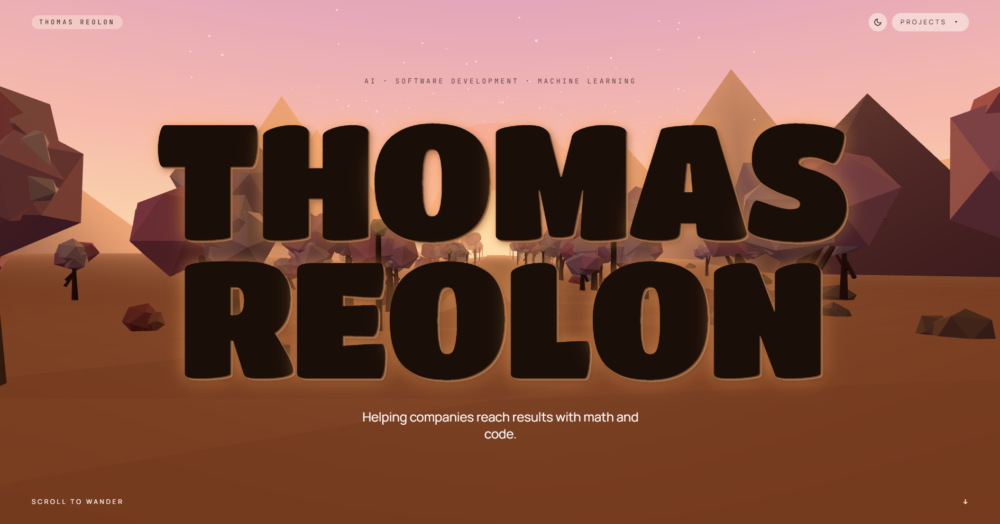

# My Portfolio

My portfolio site where I'll link useful projects and other stuff. Also, I tried to make it look cool.

you can see it at [thomasreolon.github.io](https://thomasreolon.github.io)

## Preview



## Highlights

- Immersive real-time 3D scene for engaging project presentation 🎯
- Lightweight local setup for fast development loops ⚡
- Static-web friendly structure for straightforward deployment 🚀

## Tech Stack

- JavaScript
- WebGL / 3D rendering workflow
- Modern frontend tooling

## Getting Started

```bash
npm install
npm run dev
```
